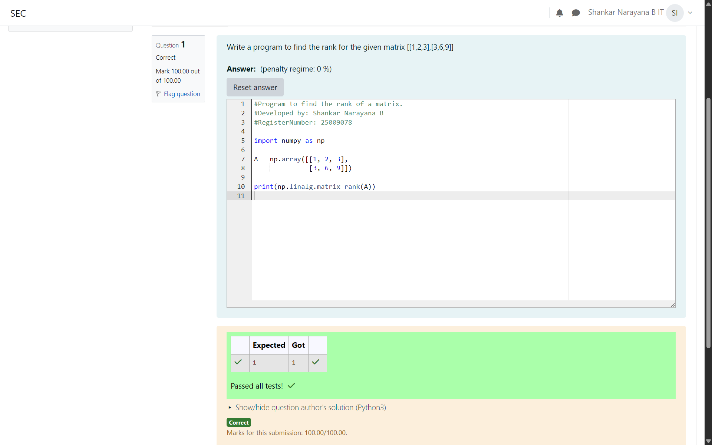

# RANK-OF-A-MATRIX

## Aim:

To write a python program to find the rank of a matrix

## Equipment’s required:

1. Hardware – PCs
2. Anaconda – Python 3.7 Installation / Moodle-Code Runner

## Algorithm:

### Step 1: Import the NumPy library.

### Step 2: Define the given matrix using a NumPy array.

### Step 3: Using the np.linalg.matrix_rank(), we can find the rank of the given matrix.

### Step 4: End the Program

## Program:

```


#Program to find the rank of a matrix.
#Developed by: Shankar Narayana B
#RegisterNumber: 25009078

import numpy as np

A = np.array([[1, 2, 3],
              [3, 6, 9]])

print(np.linalg.matrix_rank(A))


```

## Output:



## Result:

Thus the rank for the given matrix is successfully solved by using a python program.
